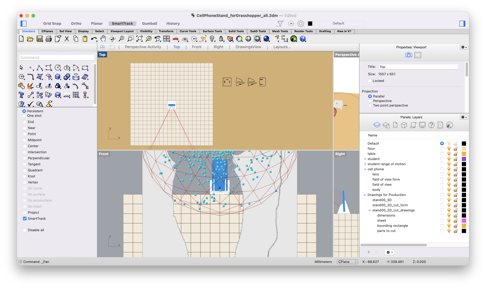

# Project1--Computational Design Week1
## GrassHopper Interface Exploration ##
My 3D modeling experience was mainly in Fusion360. The logic of making model that's being designed with exact dimension and parametric design process has different approaches to the end-product. As a new user, it's NEITHER easy to navigate through the massive network in GH NOR practice this new way of creating without any references. It would be helpful if the design process of this cellphone stand (or to say this logic tree of model making) is being explained a little bit more during class sessions. For this week's exploration, I modified 3 parameters based on my own need as for a cellphone stand.   
**Iteration Intention**: Vertically video filming with an angle makes the figure visually higher. 

**Step1**: Change viewing orientation from landscape to portrait. The phone model cliped through sometimes(the stand parts turn red when the angle got extrme? probably related to other prameters)  
**Step2**: The angle of the phone slightly tilted over 90 degree, the angle of the view going upwards.   
**Step3**: Set offset distance higher.  
I noticed the notes inside the file but the connections are still too messy to understand.   

## Problems ##
I was having trouble exporting the design because I wasn't quite understand the "BAKE" feature.

It's dispropotioned after bake. What shows inside AI. file is smaller than the actual size even though the export setting is being set to "keep scale" with 1mm to 1mm. 

 

## In shop ##
Even though I 've set up the file before I went to cut, I made some chances based on the scrape material I found in shop. 
I have experience with lasercutting before, mortly with acrylic and bristol paper. The system setting I used before have a different database where the instruction for adjustment is more clear.   
**Fails**:
- the setting for laser wasn't able to cut through the board for the first time, it went thorugh for the second time. Need more experiement when working with different material and thickness.
- Cutted parts can't fit together, I assumed that the cutout need to be slightly larger than the thickness of wood so it's can go through. 

## Speculations ##
