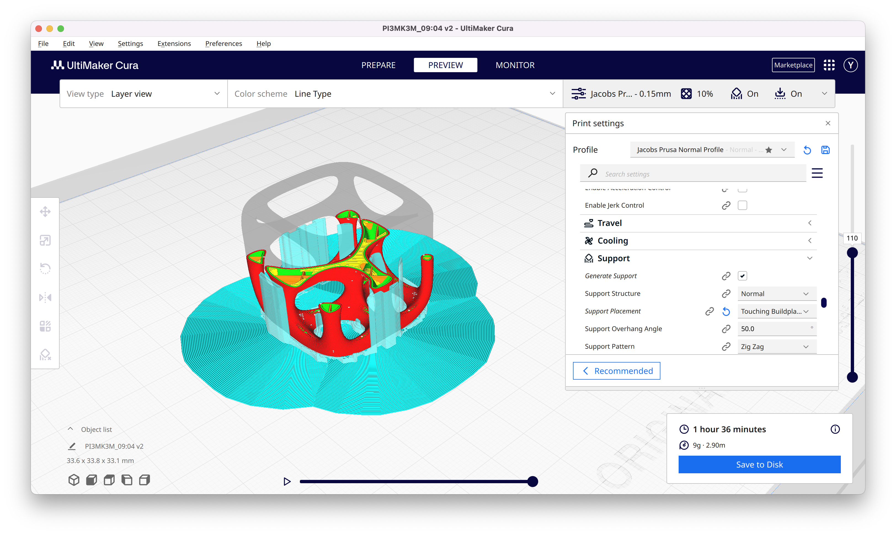
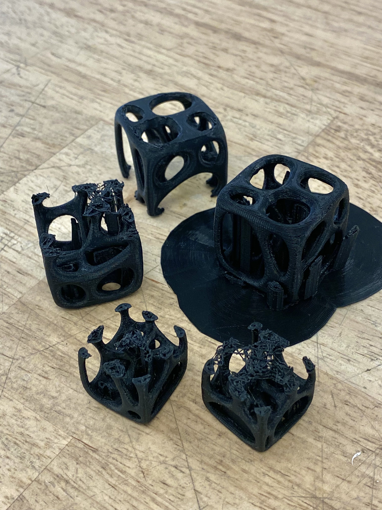

# Project1--Computational Design Week2 #
## Understanding the basics ##
Parameters store data, components define different operations based on the data input thourgh parameters. Anything build in rhino have a preset parameters hence it won't be able to change after being build. I was awared that we could bake parts seperately but still confused about how to create flat pack design or export 2D design pattern for manufacturing.  

## Start with a Geo ##
I started my exploration on Grasshopper this week by following a simple tutorial I found online and writting notes on some parameters used in the process of making. I get to know this Voronoi diagram that's being larged used in parametric modeling (need to think more about the application of this diagram in my own design.)
Even though it's a simple process, I am still a little lost on the part where the lines randomly distribute the surface and created lines in 3dimensional space, and how it grabs the date of those lines.

 

## New Phone Stand Design Trial ##
I tried to mapping out a simple list of instructions on how to build this new design 
- Starting with a point in center-->setting up three points with equal distance to the center-->3 sides polygon
- Extrude on Z axis with a number sider--> Vertex moves on axis X (tilted angles)
- Shell a triangular cone (which I ended up didn't implement)
- Create a box and tilted to certain angle
- Substarct the Phone Model (didn't make it becuase need to modify this in the orginal file)
- BooleanCombine two objects 
- Fillet edges/smooth surfaces (ideally can be done after baking?)
   
Picture below shows how I actually exacuted the plan. In step4, I tried to retrive the data of orginal plane which I failed to find this parameter. Instead, I defined a plane and it's not allowing me to snap my points to the edge of the triangular polygon. There are many times, I couldn't find a proper parameters to plug into a component(all operations require a specific data input??). Especially when getting in the last few steps, I have some many ways to fix this 
I think using parametric modeling isn't a sufficient choice of making this particular design.
 
   

- How to get point information
- Where to get data 
## Problems ##
I failed multiple times while 3D printing even though I used to consider myself as an "expert." Each machine have different setting and user manual that I need to get used to. I started with half actual size of my model, which both failed at the last few layers. I assuemed that it's because the speed of printing and the structure itself have too many hollow parts that would failed to extrend on the existing platform. I changed the contact surface of my model with printing bed, reload the setting and even thinking about cutting its top part and print it seperately. it's turned out to be the po  
  
