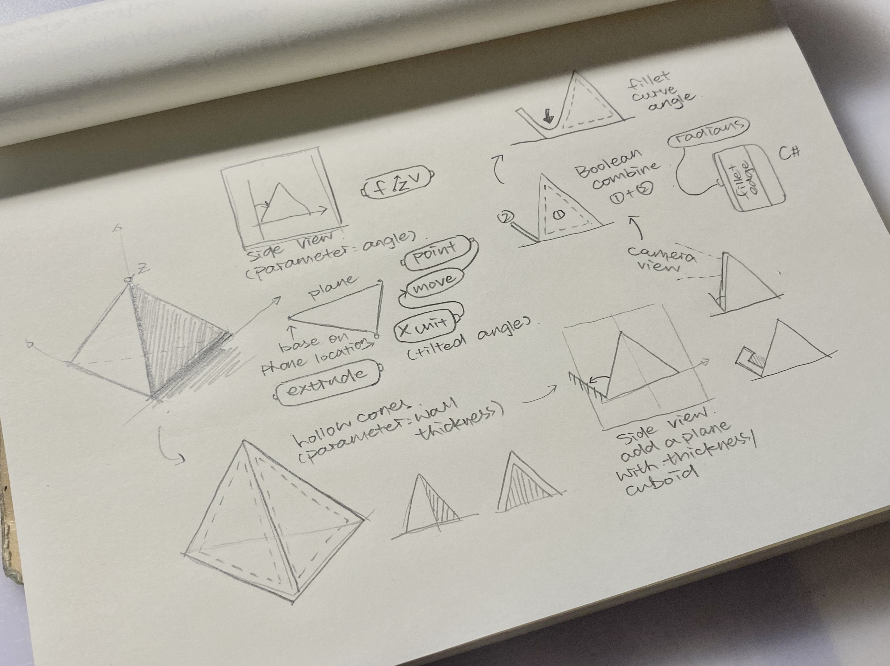

# Project1--Computational Design Week2 #
## Understanding Prameters & Componenets ##
Parameters as input
- Before baking
- Different between 2D & 3D Production

## Start with a Geo ##
Following up a simple tutorial I found online and writting notes on some parameters used in the process of making. 

## New Phone Stand Design Trial ##
  
 

## Problems ##
I failed multiple times while 3D printing even though I used to consider myself as an "expert." Each machine have different setting and user manual that I need to get used to. I started with half actual size of my model, which both failed at the last few layer. I assuemed that it's because the speed of printing and the structure itself have too many hollow part that would failed to extrend on the existing platform.   
  
