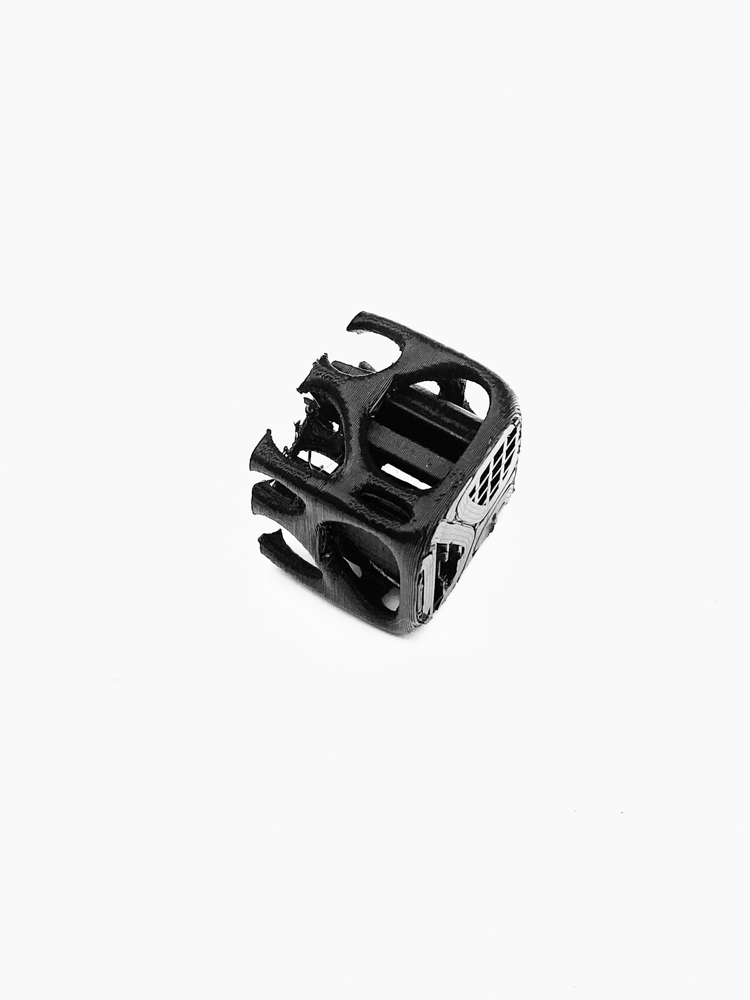

# Project1--Computational Design Week2 #
## Understanding the basics ##
Parameters stores data, components define different operations based on the data input thourgh parameters. 

## Start with a Geo ##
I started my exploration on Grasshopper this week by following a simple tutorial I found online and writting notes on some parameters used in the process of making. I get to know this Voronoi diagram that's being larged used in parametric modeling (need to think about more about the application of this diagram in my own design.)
Even though it's a simple process, I am stil a little lost on the part where the lines randomly distribute the surface and created lines in 3dimensional space. 

## New Phone Stand Design Trial ##
I tried to mapping out a simple list of instructions on how to build this new design 
- starting with a point in center-->setting up three points with equal distance to the center-->3 sides polygon
- Extrude on Z axis with number siders--> Vertex moves on axis x(tilted angles)
- Shell a triangular cone (which I ended up didn't implement)
- Create a box and tilted to certain angle
- BooleanCombine two objects
- Fillet edge
   
 Wasn't able to correctly setting plane.
I think using parametric modeling isn't a sufficient choice of making this particular design.
 
   

- How to get point information
- Where to get data 
## Problems ##
I failed multiple times while 3D printing even though I used to consider myself as an "expert." Each machine have different setting and user manual that I need to get used to. I started with half actual size of my model, which both failed at the last few layer. I assuemed that it's because the speed of printing and the structure itself have too many hollow parts that would failed to extrend on the existing platform.   
  
