# Project1--Computational Design Week3 #
**DESIGN INTENT:** A stable phone stand supports both vertical and horizontal viewing.  
**DIFFICULTY LEVEL:** 02-⭐️⭐️  (My exploration is not only about get acquaintance with gh interfaces but also the design itself. I only use some basic components for this experiment, still need more time to mess around with GH in future projects.)  
**CHALLENGES:**
1. Understand components parts in GH
2. Practicing designing connections between elements (points, lines, planes, geometries...)
3. Reading the GH file and study its logic of making (still in progress)
4. Mastering pruse printer setting at Jacobs 

## PROCESS ##
**First Iteration:** Following up the file I created last week, I printed out a test stand which works pretty well. I reduced the infill to 5% but still wasn't satisfied with the interior strcture, and feel like there's a chunk of extra material being used. (approx.4hrs)  
  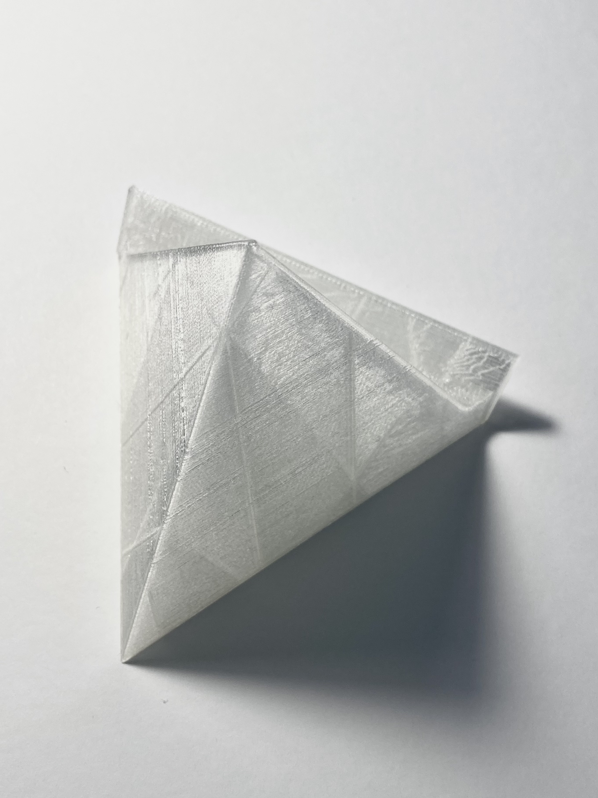      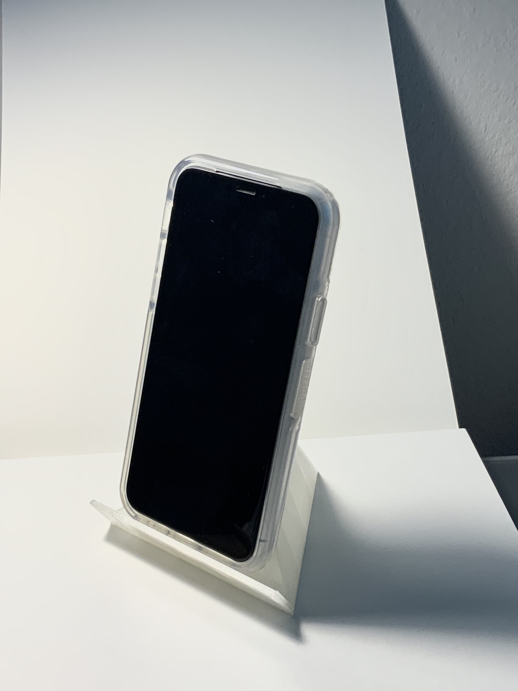  
> (caption: L.GH file/ M.Print test result/ R.Stand in Use)

**Second Iteration:** I was aiming for reducing mataerial and flexibility in using for my second iteration. The plan was to have a triangular frame and different sizes platforms locking at multiple heights on the frame, adding this feature of adjustable heights. However, after I printed out a miniture version to test the strength of this, it turns out to be a major failure. The platform can't be secured in place on the traingular frame.(I even leave a 2mm gap while printing 2 parts) In addition, I wasn't think about the weight of the phone. The platform will tilled to one side. I struggled to define the cross section between the platform plane height and the frame, and ended up only loft a solid platform. The rest design I achieved using Fusion360.  
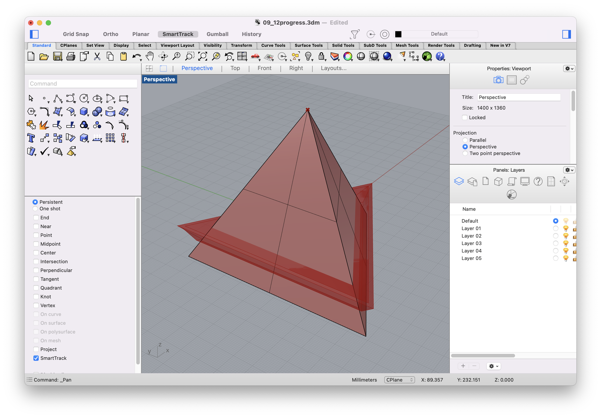 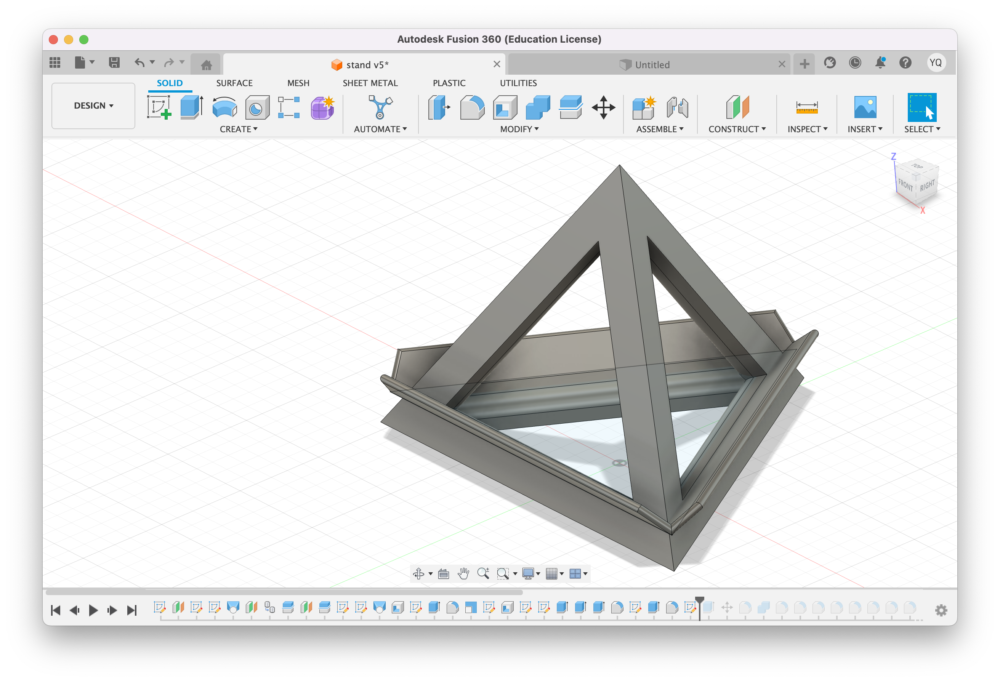
Thoughts on this failed iteration: Because I couldn't find a way to make the height as a variable and define the percise cross sections, the size of the platform is not accurate. If the platform rest on a higher part of this frame, the phone will undoubtly fall because the phone doesn't have enough contact surface with the stand itself. 
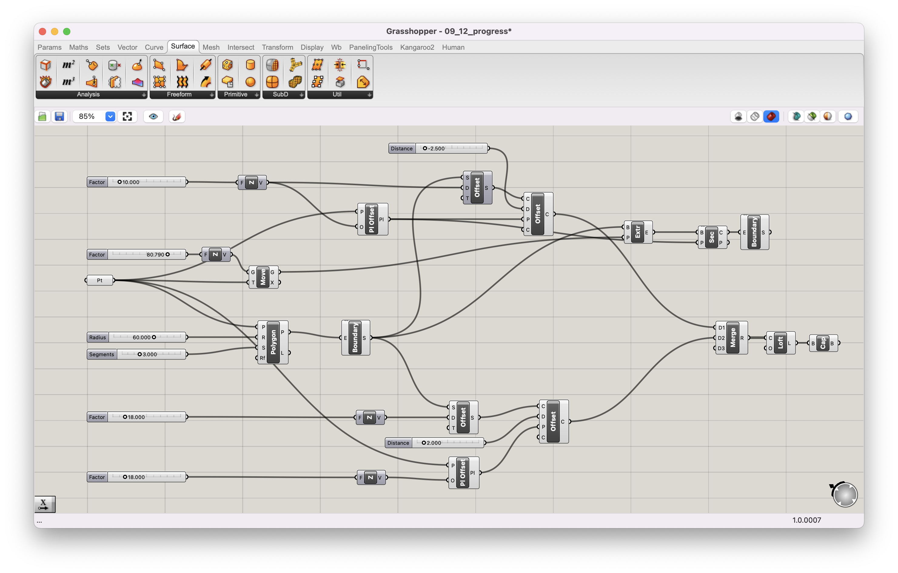 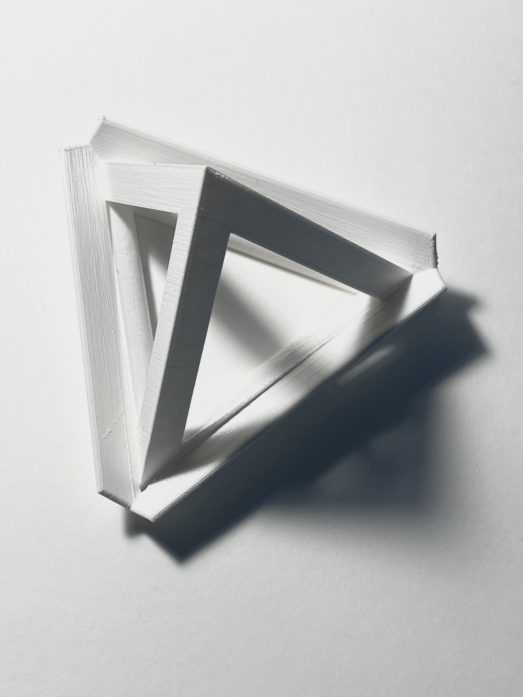

## RESULT ##
I landed on combining my previous 2 iterations into this final model. I added few more components in GH file to shell the entity and fillet the edges. Few final polishing details, I still finished them with the help of Fusion. Thanks to Cody, I finally find the way to build files compatible for both Rhino and Fusion. The overhang angles are set larger than 45 degrees, so it got printed out cleanly without any support, the printing time also being reduced to 2hrs 40mins. There's no big weight difference, but in gernal it's quite easy to carry around. This model have pretty much perfect size. While in use, the support structure is seemless 
ot too small to bearing the weight, and it can also be used as a stand for my glasses or may be kychain or something else:) Not expected that to happen. Already using it while making videocall😗  
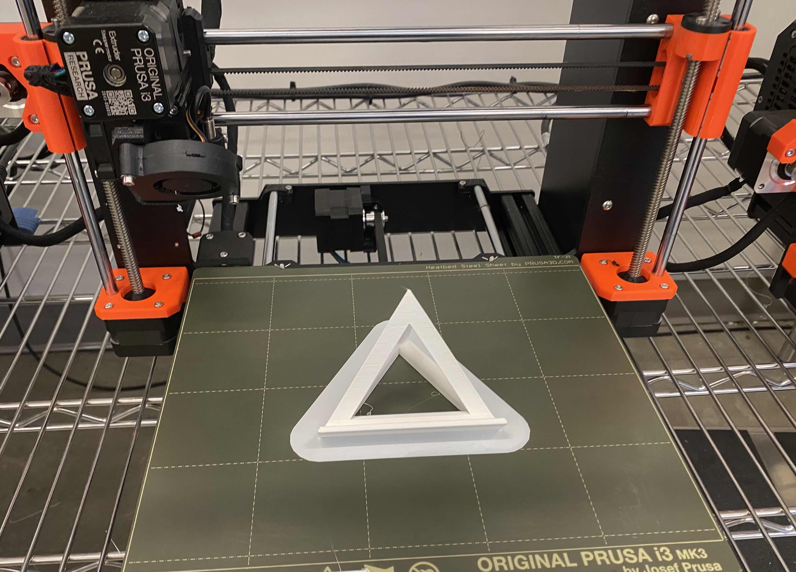 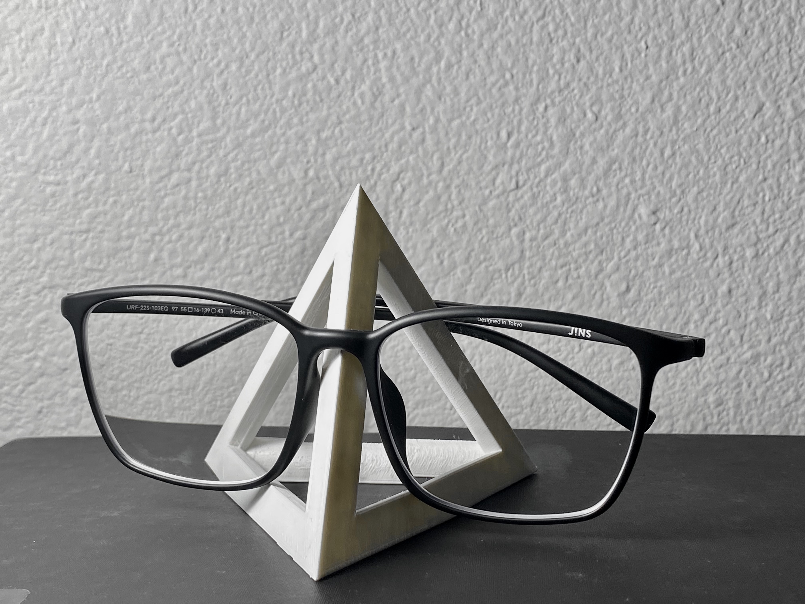  
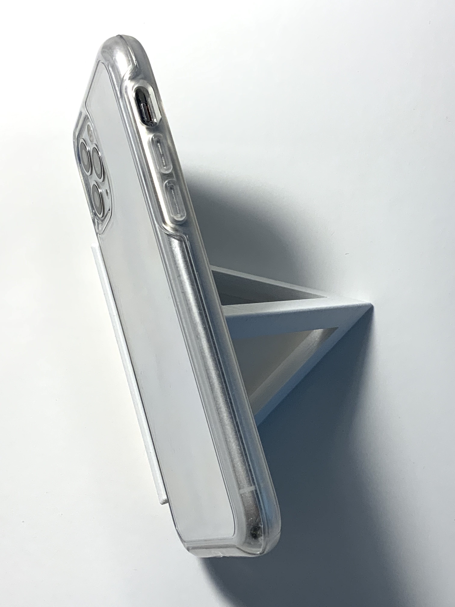 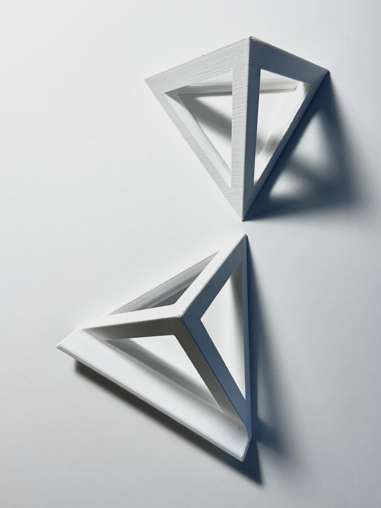 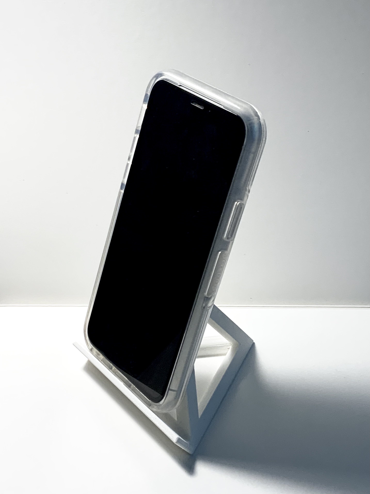  

> **To be Continued...**

