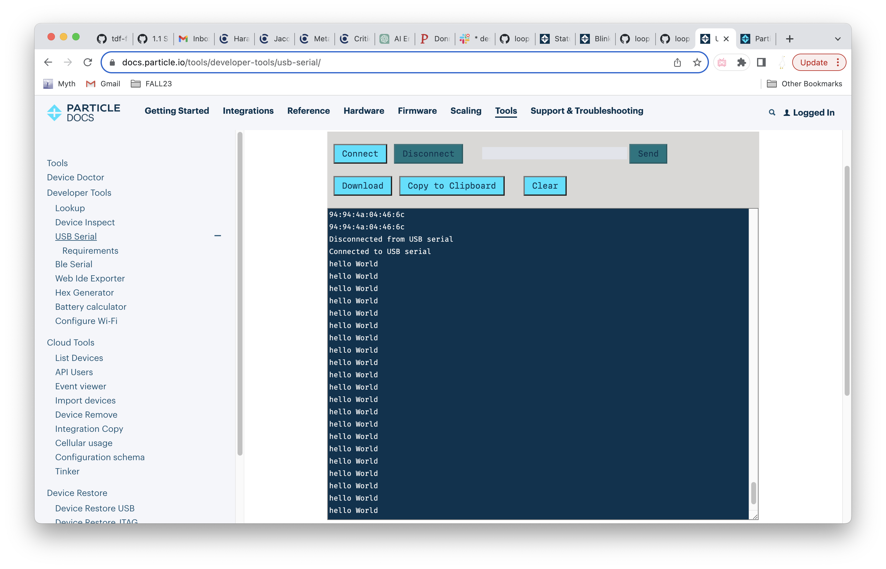
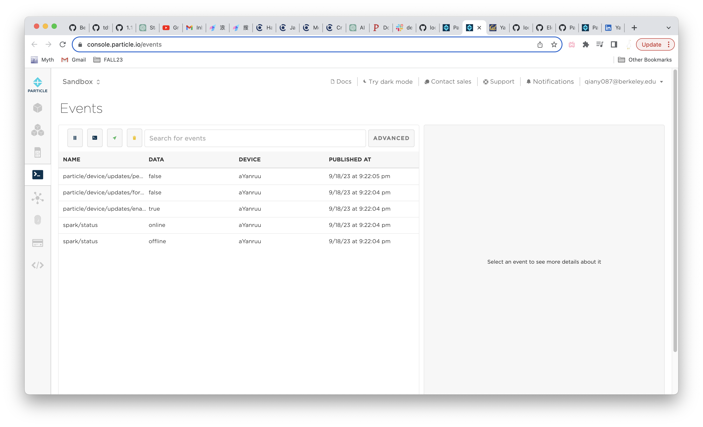
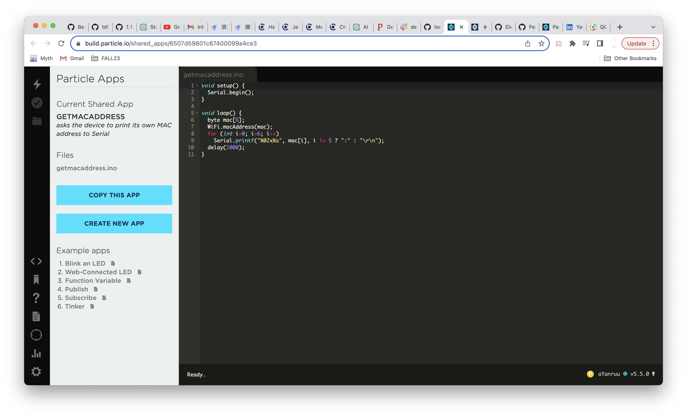
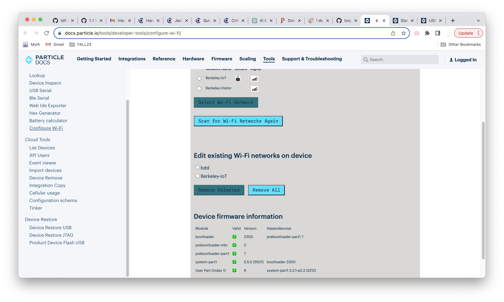
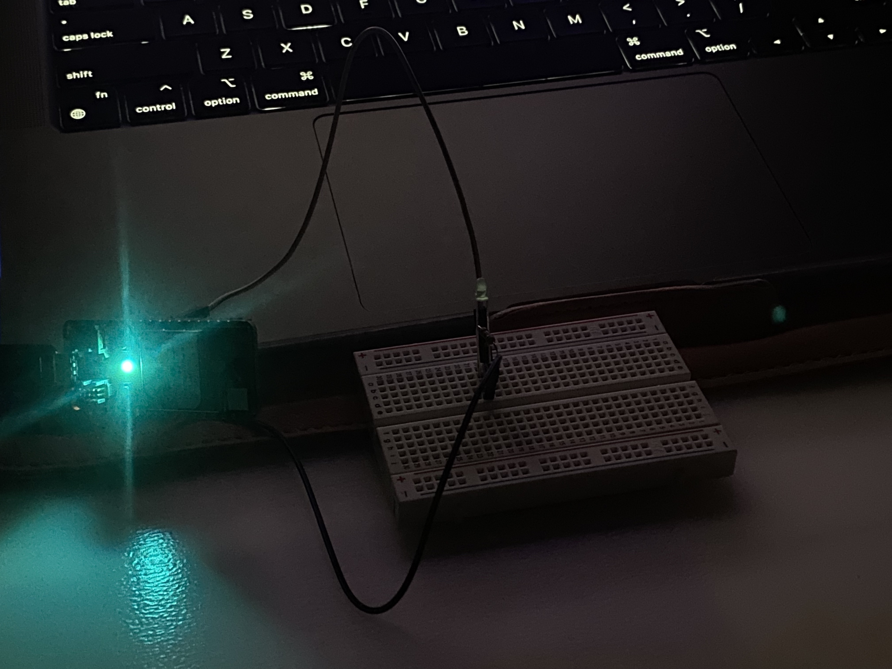
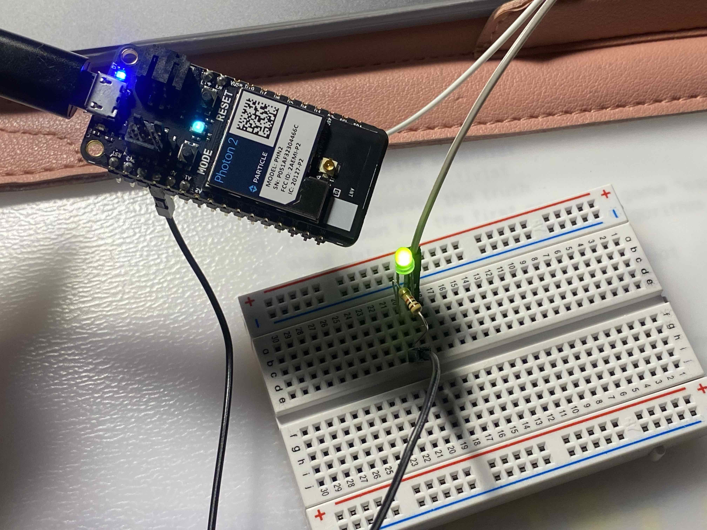
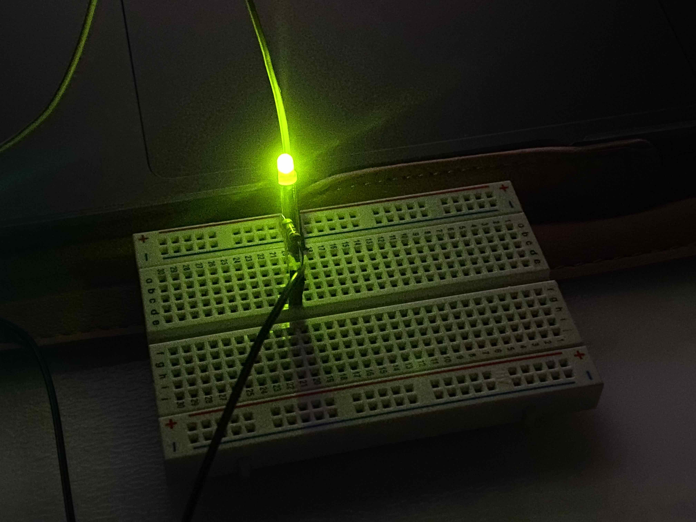

# Helloworld HelloPhoton 🙌🏻 #

### NETWORK CONNECTION ### 
I wasn't able to flash the linked FILE in the turotrial until I figured it out that shared app can't be sent to the device. There are many similarities between Photon2 and Arduino, but the online cloud where devices' status are recorded and code are stored is different then arduino. It could be an efficient add-on feature since it organizes all the information happened to the device. The status lighting are tricky, probably need some time to get use to it.  
     
Connected device to the network at home and school⬇️

### BLINK TEST 💡 ###  
Retrive the following code from database for blinking a LED
> int led = D7;  
void setup() {  
  pinMode(led, OUTPUT);  
}   
void loop() {  
digitalWrite(led, HIGH);  
delay(1000);  
digitalWrite(led, LOW);  
delay(1000);  
}

     

https://github.com/Berkeley-MDes/tdf-fa23-YanruQ/assets/142960866/41afe94f-e4a0-4284-ac9e-8452685b57e2

